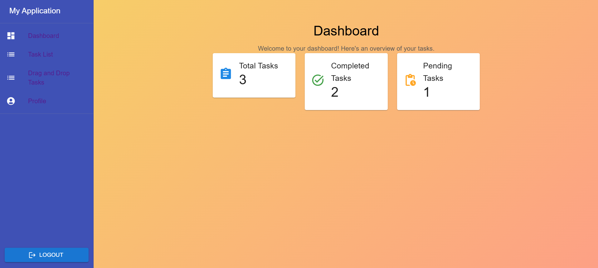

# Task Management

Welcome to the **Task Management** project. This MERN (MongoDB, Express, React, Node.js) application allows users to manage their tasks with an intuitive interface and **Drag and Drop** functionality.

## Table of Contents

- [Features](#Features)
- [Screenshots](#Screenshots)
- [Technologies Used](#Technologies-Used)
- [Installation](#Installation)
- [Configuration](#Configuration)
- [Usage](#Usage)
- [Project Structure](#Project-Structure)

---

## Features

- **User Authentication** : Secure login using JWT.
- **Add Tasks:** : Create a new task with a title and description.
- **Update Tasks:** : Edit the title and description of existing tasks.
- **Delete Tasks** : Remove an existing task.
- **Change Task Status** : Move tasks between **To Do** and **Done** using drag-and-drop functionality.

---

## Screenshots

### Tableau de Bord

A dynamic overview of total, completed, and pending tasks.


### Gestion des Tâches


Intuitive drag-and-drop functionality to move tasks between the "To Do" and "Done" columns.


## Technologies-Used

- **Backend** : Node.js, Express.js, MongoDB, Mongoose
- **Frontend** : React.js, ReactSortable, Material-UI, Axios
- **Authentification** : JSON Web Token (JWT)

---

## Installation

### Prérequis

- **Node.js** (version 14.x or higher)
- **MongoDB** (installed locally or via a cloud service like Atlas)
- **npm** ou **yarn**

### Installation Steps

1. **Clone the project:** :

   ```bash
   git clone https://github.com/MariemSoualhia/To-Do-List-mern-project.git
   cd gestion-taches-mern

   ```

2. Install backend dependencies::

   ```
   cd backend
   npm install
   ```

3. Install frontend dependencies:

   ```
   cd ../frontend
   npm install

   ```

### Configuration

Create a .env file in the backend directory and add the required configurations: :

```
# .env file
PORT=5000
MONGO_URI=mongodb://localhost:27017/gestion-taches
JWT_SECRET=votre_secret_jwt
```

### Usage

1. Start the backend :
   ```
   cd backend
   npm start
   ```
2. Start the frontend :
   ```
   cd ../frontend
   npm start
   ```

### Project-Structure

The project structure is as follows: :

```
gestion-taches-mern/
│
├── backend/
│   ├── controllers/
│   ├── middleware/
│   ├── models/
│   ├── routes/
│   ├── .env
│   ├── package.json
│   └── server.js
│
├── frontend/
│   ├── src/
│   │   ├── components/
│   │   ├── services/
│   │   ├── App.js
│   │   ├── index.js
│   │   └── styles/
│   ├── package.json
│   └── public/
│
└── README.md

```
